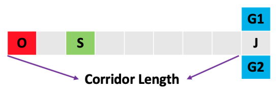
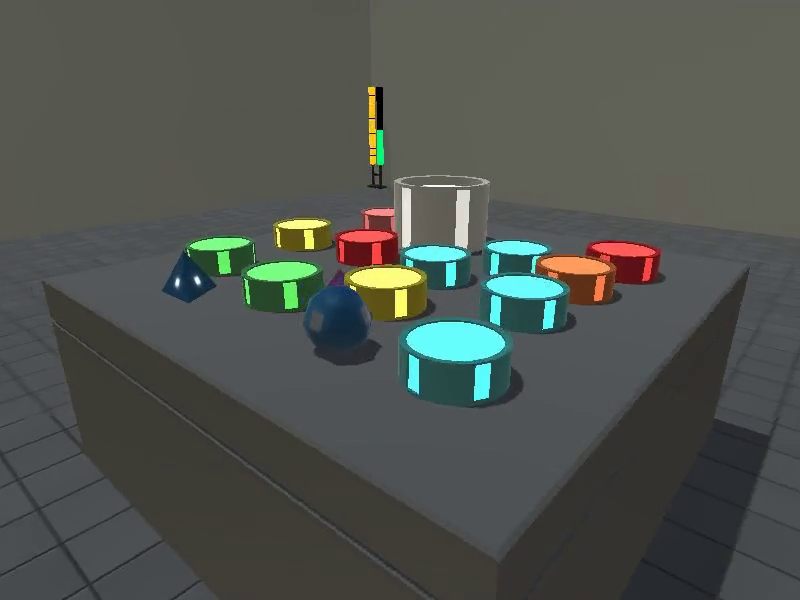
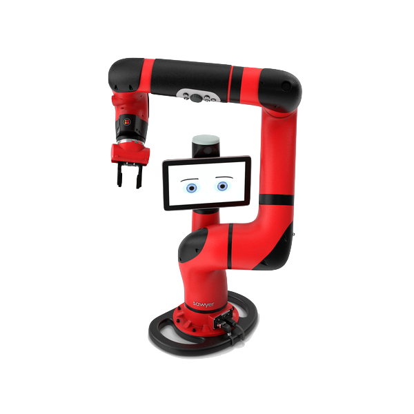
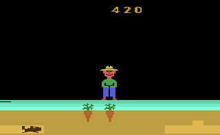
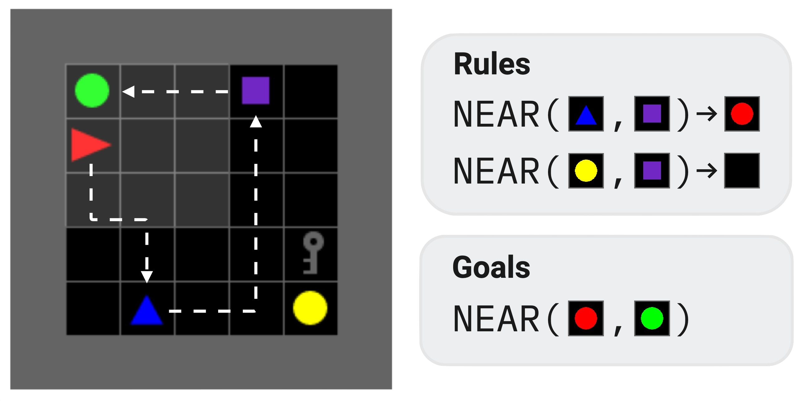
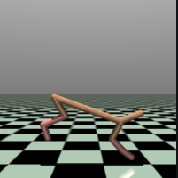
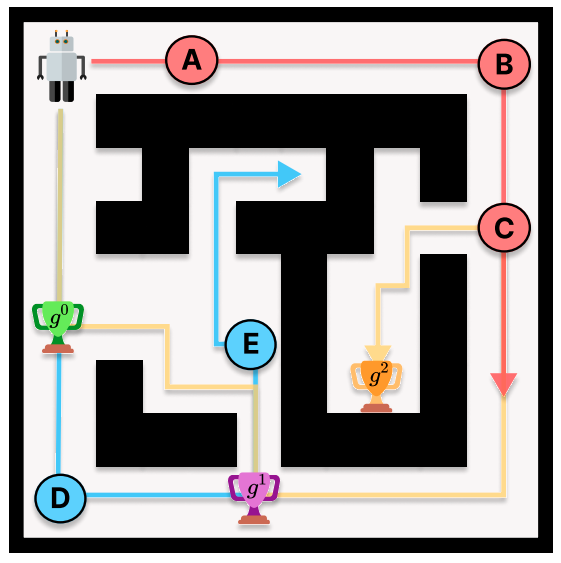
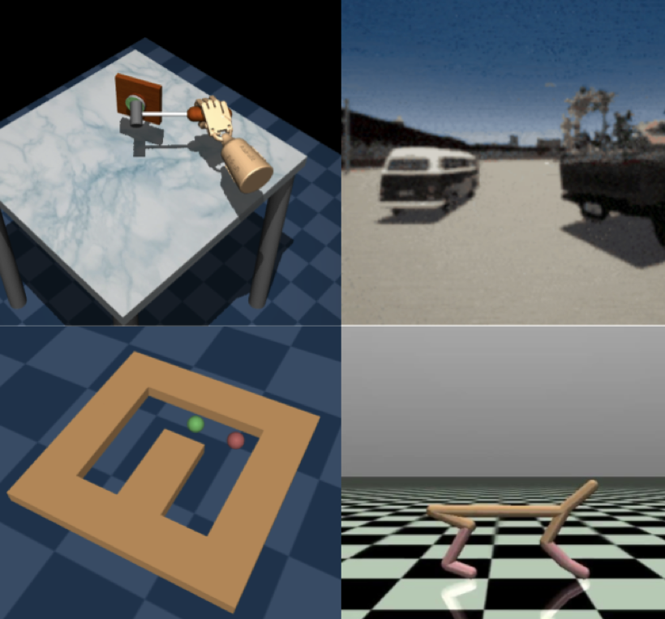

<div align="center">
    
</div>

<h3 align="center">Adaptive RL with Long-Term Memory</h2>

<br>


<div align="center">
    <a href="https://arxiv.org/abs/2310.09971">
        
    </a>
    <a href="https://arxiv.org/abs/2411.11188">
        
    </a>
    <a href="https://ut-austin-rpl.github.io/amago">
        
    </a>
</div>

<br>
<br>

AMAGO is a high-powered off-policy version of [RL^2](https://arxiv.org/abs/1611.02779) for training large policies on long sequences. 
It follows a simple and scalable perspective on RL generalization:

1. Turn meta-learning into a *memory* problem ("black-box meta-RL").
2. Put all of our effort into learning effective memory with end-to-end RL.
3. View other RL settings as special cases of meta-RL.
4. Use the same method for every problem while staying customizable for research.

Some highlights:

- **Broadly Applicable**. Long-term memory, meta-learning, multi-task RL, and zero-shot generalization are special cases of its POMDP format. Supports discrete and continuous actions. Online and offline RL. See examples below!
- **Scalable**. Train large policies on long context sequences across multiple GPUs with parallel actors, asynchronous learning/rollouts, and large replay buffers stored on disk.
- **Easy to Modify**. Modular and configurable. Swap in your own model architectures, RL objectives, and datasets.


<br>

___

<br>

## Installation 
```shell
# download source
git clone git@github.com:UT-Austin-RPL/amago.git
# make a fresh conda environment with python 3.10+
conda create -n amago python==3.10
conda activate amago
# install core agent
pip install -e amago
```

- `pip install -e amago[flash]`: The base Transformer policy uses [FlashAttention 2.0](https://github.com/Dao-AILab/flash-attention) by default. We recommend installing `flash_attn` if your GPU is compatible. Please refer to the [official installation instructions](https://github.com/Dao-AILab/flash-attention) if you run into issues.

There are some optional installs for additional features:

- `pip install -e amago[mamba]`: Enables [Mamba](https://arxiv.org/abs/2312.00752) sequence model policies. 

- `pip install -e amago[envs]`: AMAGO comes with built-in support for a wide range of existing and custom meta-RL/generalization/memory domains (`amago/envs/builtin`) used in our experiments. This command installs (most of) the dependencies you'd need to run the [`examples/`](examples/).

> [!TIP]
> AMAGO requires `gymnasium` <= 0.29. It is not compatible with the recent `gymnasium` 1.0 release. Please check your `gymnasium` version if you see environment-related error messages on startup.

<br>

## Examples, Tutorial, and Documentation
We now have some rough [documentation](https://ut-austin-rpl.github.io/amago), including a full [tutorial](https://ut-austin-rpl.github.io/amago/tutorial.html).


The [`examples/`](examples/) folder includes helpful starting points for common cases. 

To follow most of the examples you'll need to install the benchmark environments with `pip install amago[envs]`. If you want to log to `wandb` or check out some of the example results, it's worth reading [this section of the tutorial](https://github.com/UT-Austin-RPL/amago/blob/main/tutorial.md#track-the-results). The public `wandb` links include example commands (click the "Overview" tab). Building this set of public examples with the new version of AMAGO is an active work in progress.

Use the `CUDA_VISIBLE_DEVICES` environment variable to assign basic single-GPU examples to a specific GPU index. Most of the examples share a command line interface. Use `--help` for more information.


### 0. **Intro to Black-Box Meta-RL: Meta-Frozen-Lake**
**[`00_meta_frozen_lake.py`](examples/00_meta_frozen_lake.py)**


Learn more about adaptive policies with help from an intuitive meta-RL problem. Train an agent to adapt over multiple episodes by learning to avoid its previous mistakes.

[Example `wandb`](https://wandb.ai/jakegrigsby/amago-v3-reference/runs/a53gh0wy)

<br>


### 1. **Basic Gymnasium**
**[`01_basic_gym.py`](examples/01_basic_gym.py)**

Typical RL benchmarks are MDPs and can be treated as a simple special case of the full agent. Memory is often redundant but these tasks can be helpful for testing.

[Example `wandb` for LunarLander-v2 with a Transformer](https://wandb.ai/jakegrigsby/amago-v3-reference/runs/30ndyo2l)

[Example `wandb` for DM Control Suite Cheetah Run](https://wandb.ai/jakegrigsby/amago-v3-reference/runs/0znibfm2)

<br>

### 2. **GPU-Accelerated Envs: Gymnax**
**[`02_gymnax.py`](examples/02_gymnax.py)**


Like `gymnasium`, but 1000x faster! Use `jax` to add more `--parallel_actors` and speedup experiments. [`gymnax`](https://github.com/RobertTLange/gymnax) includes several interesting memory problems.

[Example `wandb` for MemoryChain-bsuite](https://wandb.ai/jakegrigsby/amago-v3-reference/runs/7qe1pu41/)

**📊 Experimental 📊**. Support for `gymnax` is a new feature.

<br>

### 3. **POMDPs: POPGym**
**[`03_popgym_suite.py`](examples/03_popgym_suite.py)**


[POPGym](https://arxiv.org/abs/2303.01859) is a collection of memory unit-tests for RL agents. AMAGO is really good at POPGym and turns most of these tasks into quick experiments for fast prototyping. Our `MultiDomainPOPGym` env concatenates POPGym domains into a harder one-shot multi-task problem discussed in the followup paper.

[Example `wandb`](https://wandb.ai/jakegrigsby/amago-v3-reference/runs/nhyxu2g1). These settings can be copied across every task in the ICLR paper.

<br>

### 4. **Super Long-Term Recall: T-Maze**
**[`04_tmaze.py`](examples/04_tmaze.py)**



T-Maze is a modified version of the problem featured in [Ni et al., 2023](https://arxiv.org/abs/2307.03864). T-Maze answers the question: RL issues (mostly) aside, what is the most distant memory our sequence model can recall? When using Transformers, the answer is usually whatever we can fit on the GPU...

[Example `wandb`](https://wandb.ai/jakegrigsby/amago-v3-reference/runs/8t5bdqmu)

<br>

### 5. **Finite-Horizon Meta-RL: Dark Key-To-Door**
**[`05_dark_key_door.py`](examples/05_dark_key_door.py)**

A common meta-RL problem where the environment resets for a fixed number of timesteps (rather than attempts) so that the agent is rewarded for finding a solution quickly in order to finish the task as many times as possible. Loosely based on experiments in [Algorithm Distillation](https://arxiv.org/abs/2210.14215).

[Example `wandb`](https://wandb.ai/jakegrigsby/amago-v3-reference/runs/a6adhfg3)

<br>

### 6. **Meta-RL: Symbolic DeepMind Alchemy**
**[`06_alchemy.py`](examples/06_alchemy.py)**





Symbolic version of the [DeepMind Alchemy](https://arxiv.org/abs/2102.02926) meta-RL domain.

**🔥 Challenging 🔥**. Alchemy has a hard local max strategy that can take many samples to break. We've found this domain to be very expensive and hard to tune, though we can usually match the pure-RL (VMPO) baseline from the original paper. We've never used Alchemy in our published results but maintain this script as a starting point.

Example `wandb` from a recent large-scale attempt with the Multi-Task agent: [Actor Process](https://wandb.ai/jakegrigsby/amago-v3-reference/runs/s85fw2kn) or [Learner Process](https://wandb.ai/jakegrigsby/amago-v3-reference/runs/1ic57f70).


<br>


### 7. **Meta-RL: Meta-World**
**[`07_metaworld.py`](examples/07_metaworld.py)**



[Meta-World](https://meta-world.github.io) creates a meta-RL benchmark out of robotic manipulation tasks. Meta-World ML45 is a great example of why we'd want to use the `MultiTaskAgent` learning update. For much more information please refer to our NeurIPS 2024 paper.

[Example `wandb` (`MultiTaskAgent` on ML45!)](https://wandb.ai/jakegrigsby/amago-v3-reference/runs/gq9s8vxs).

<br>

### 8. **Multi-Task RL: Atari**
**[`08_ale.py`](examples/08_ale.py)**



Multi-Task RL is a special case of meta-RL where the identity of each task is directly provided or can be inferred without memory. We focus on the uncommon setting of learning from *unclipped* rewards because it isolates the challenge of optimizing distinct reward functions. See the NeurIPS 2024 paper for more.

[Example `wandb` for an easy 4-game variant](https://wandb.ai/jakegrigsby/amago-v3-reference/runs/gzgdshjb)

<br>

### 9. **Multi-Game Two-Episode Procgen**
**[`09_multitask_procgen.py`](examples/09_multitask_procgen.py)**


Multi-Game [Procgen](https://arxiv.org/abs/1912.01588) has a similar feel to Atari. However, Procgen's procedural generation and partial observability (especially in "memory" mode) is better suited to multi-episodic adaptation. This example highlights the `TwoAttemptMTProcgen` setup used by experiments in the second paper.

<br>

### 10. **Multi-Task BabyAI**
**[`10_babyai.py`](examples/10_babyai.py)**


[BabyAI](https://arxiv.org/abs/1810.08272) is a collection of procedurally generated gridworld tasks with simple lanugage instructions. We create a fun multi-task variant for adaptive agents.

[Example multi-seed report](https://wandb.ai/jakegrigsby/amago-v3-reference/reports/Multi-Task-BabyAI-AMAGOv2--Vmlldzo5ODAxNjc1) (which uses an outdated version of AMAGO).


<br>

### **11. XLand MiniGrid**
**[`11_xland_minigrid.py`](examples/11_xland_minigrid.py)**




[XLand-MiniGrid](https://arxiv.org/abs/2312.12044) is a `jax`-accelerated environment that brings the task diversity of [AdA](https://arxiv.org/abs/2301.07608) to [Minigrid](https://arxiv.org/abs/2306.13831)/BabyAI-style gridworlds.

**📊 Experimental 📊**. Support for XLand MiniGrid is a new feature. 

<br>

### **12. Toy Meta-RL / Locomotion: HalfCheetahVelocity (w/ HalfCheetahV4)**
**[`12_half_cheetah_vel.py`](examples/12_half_cheetah_vel.py)**



A more modern remaster of the famous [HalfCheetahVel mujoco meta-RL benchmark](https://arxiv.org/pdf/1703.03400), where the cheetah from the [HalfCheetah-v4 gymnasium task](https://gymnasium.farama.org/environments/mujoco/half_cheetah/) needs to run at a randomly sampled (hidden) target velocity based on reward signals.

[Example `wandb`](https://wandb.ai/jakegrigsby/amago-v3-reference/runs/jveklygo)

<br>


### **13. Hindsight Relabeling: MazeRunner**
**[`13_mazerunner_relabeling.py`](examples/13_mazerunner_relabeling.py)**



Off-policy learning makes it easy to relabel old sequence data with new rewards. MazeRunner is a goal-conditioned POMDP navigation problem used to discuss & test the hindsight instruction relabeling technique in our paper. This example includes a template for using hindsight relabeling in the new version of AMAGO.

[Example `wandb`](https://wandb.ai/jakegrigsby/amago-v3-reference/runs/a728v6k0)

<br>


### **14. Offline-to-Online RL: D4RL**
**[`14_d4rl.py`](examples/14_d4rl.py)**



Offline RL on the (original) [D4RL](https://arxiv.org/pdf/2004.07219) datasets. 

[Example `wandb`](https://wandb.ai/jakegrigsby/amago-v3-reference/runs/9ab15rr8)


<br>

---

<br>


## Citation
```
@inproceedings{
  grigsby2024amago,
  title={{AMAGO}: Scalable In-Context Reinforcement Learning for Adaptive Agents},
  author={Jake Grigsby and Linxi Fan and Yuke Zhu},
  booktitle={The Twelfth International Conference on Learning Representations},
  year={2024},
  url={https://openreview.net/forum?id=M6XWoEdmwf}
}

```

```
@inproceedings{
  grigsby2024amago2,
  title={{AMAGO}-2: Breaking the Multi-Task Barrier in Meta-Reinforcement Learning with Transformers},
  author={Jake Grigsby and Justin Sasek and Samyak Parajuli and Daniel Adebi and Amy Zhang and Yuke Zhu},
  booktitle={The Thirty-eighth Annual Conference on Neural Information Processing Systems},
  year={2024},
  url={https://openreview.net/forum?id=OSHaRf4TVU}
}
```

