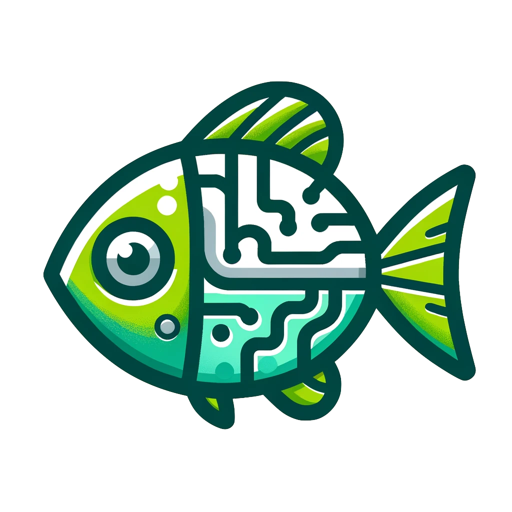
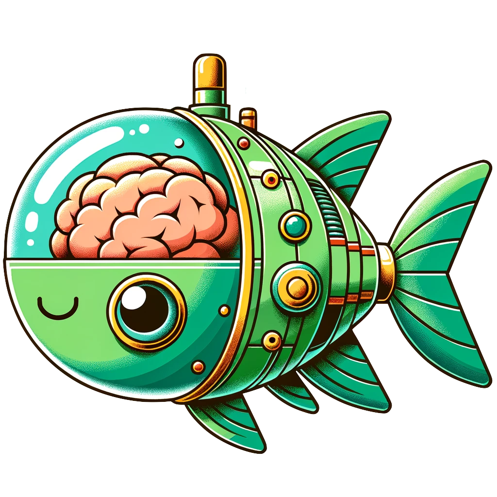

# AMAGO 
#### [Paper (ICLR 2024 Spotlight)](https://arxiv.org/abs/2310.09971) | [Project Website](https://ut-austin-rpl.github.io/amago/)



<br>

### A simple and scalable agent for sequence-based Reinforcement Learning

AMAGO is a POMDP solver with an emphasis on long sequences, sparse rewards, and large networks. It is:
- **Broadly Applicable**. Classic benchmarks, goal-conditioning, long-term memory, meta-learning, and generalization are all special cases of its POMDP format. Supports discrete and continuous actions.
- **Scalable**. Designed for training large policies (like Transformers) on long sequences (500+ timesteps). AMAGO supports multi-GPU training with parallel actors, asynchronous learning/rollouts, and large replay buffers (stored on disk).
- **Sample Efficient**. AMAGO is off-policy and can continuously reuse (and hindsight relabel) large datasets of past trajectories.
- **Easy to Use**. Technical details can be easily customized but are designed to require little hyperparamter tuning. See examples below.

<br>

## Background
AMAGO treats multi-task RL, meta-RL, RL generalization, and long-term memory as variations of the same POMDP problem that can be solved with sequence learning. This core framework goes by many different names including [implicit partial observability](https://arxiv.org/abs/2107.06277), [context-based meta-learning](https://arxiv.org/abs/2301.08028), or [contextual MDPs](https://arxiv.org/abs/2111.09794).

AMAGO learns from off-policy or offline data, which improves sample efficiency and enables hindsight experience replay for goal-conditioned environments. We find a stable and high-performance way to train off-policy actor-critic agents on top of the representations from a shared sequence model, and all of the low-level details have been redesigned from scratch to be scalable enough to train long-context Transformers. Please refer to our [paper](https://arxiv.org/abs/2310.09971) for a detailed explanation.

<br>

## Installation 

```bash
# download source
git clone git@github.com:UT-Austin-RPL/amago.git
cd amago
# make a fresh conda environment with python 3.10
conda create -n amago python==3.10
conda activate amago
# install core agent
pip install -e .
# AMAGO includes built-in support for a number of benchmark environments that can be installed with:
pip install -e .[envs]
```
The default Transformer policy (`nets.traj_encoders.TformerTrajEncoder`) has an option for [FlashAttention 2.0](https://github.com/Dao-AILab/flash-attention). FlashAttention leads to significant speedups on long sequences if your GPU is compatible. We try to install this for you with: `pip install -e .[flash]`, but please refer to the [official installation instructions](https://github.com/Dao-AILab/flash-attention) if you run into issues.

<br>

## Getting Started
Applying AMAGO to any new environment requires 5 basic choices. The `examples/` folder includes helpful starting points for common cases.

<p align="center">

</p>

1. **How do timesteps become vectors?** AMAGO standardizes its training process by creating a `TstepEncoder` to map timesteps to a fixed size representation. Timesteps (`hindsight.Timestep`) consist of observations, meta-RL data (rewards, dones, actions, reset signals), and optional goal descriptions. We include customizable defaults for the two most common cases of images and state arrays.

2. **How do sequences of timestep vectors become sequences of POMDP state vectors?** The `TrajEncoder` is a seq2seq model that enables long-term memory and in-context learning by processing `TstepEncoder` outputs. AMAGO is designed for large-scale sequence models like Transformers.

3. **What defines the end of a rollout?** Are we optimizing a single trial that ends when the environment terminates, or is this a meta-RL setting where we should auto reset to the same environment until a fixed time limit is reached? In any case we need to define an upper bound on the rollout length (`horizon`).
   
4. **What is the memory limit of our policy?** True meta-RL and long-term memory tasks would require a `max_seq_len` >= the horizon. If the horizon is unrealisticlly long or unncessary for the complexity of the problem, we can approximate by shortening the context.
   
5. **How often do we save sequences as training samples, even if the rollout hasn't ended?** Parallel actors automatically save `.traj` files for rollouts up to this length, which should >= `max_seq_len`. As a general rule, `traj_save_len > horizon` unless rollouts are >> `max_seq_len` and we need to speedup reads from disk during training.

<p align="center">

</p>

<br>

## Tutorial

To follow most of the examples you'll need to install the benchmark environments with `pip install amago[envs]`.

You can configure the project and account with environment variables:

```bash
export AMAGO_WANDB_PROJECT="wandb project name"
export AMAGO_WANDB_ENTITY="wandb username"
```
For basic single-GPU agents, use the `CUDA_VISIBLE_DEVICES` environment variable to assign learning to a specific GPU index (`CUDA_VISIBLE_DEVICES=7 python train.py ...`).

Environment setup is the main step in applying our agent to a new problem. The example environments are usually *not* included in the scripts themselves but can be found in `amago/envs/builtin/`.

### 1. **Regular MDPs (Classic Gym)**
   
Many popular benchmarks are MDPs and can be treated as a simple special case of the full agent. By turning *off* most of AMAGO's features, we can create a regular off-policy actor-critic like you've seen before. See `examples/01_basic_gym.py` for an example.

 Try `python 01_basic_gym.py --help` for an explanation of hyperparameters and other command line args that are used in most of the examples below.

<details>
<summary> <b>Example Training Commands</b> </summary>
<br>

Train a memory-free policy on built-in gymnasium benchmarks:

```bash
python 01_basic_gym.py --env LunarLander-v2 --horizon 500 --traj_encoder ff --max_seq_len 32 --memory_layers 2 --no_async --run_name <str> --buffer_dir <path>
```
This examples uses a `TrajEncoder` that is just a feedforward network. Training still depends on sequences of `--max_seq_len` timesteps, which is effectively increasing the training batch size.
</details>

#### AMAGO Output Directories
Aside from the `wandb` logging metrics, AMAGO outputs data in the following format (listed according to the arguments of the main `learning.Experiment` trainer or the command line args of the examples):

```bash
{Experiment.dset_root} or {--buffer_dir}/
    - {Experiment.dset_name} or {--run_name}/
        - train/
            # replay buffer of sequence data stored on disk as `*.traj` files
            {environment_name}_{random_id}_{unix_time}.traj
            {environment_name}_{another_random_id}_{later_unix_time}.traj
            ...
        - {Experiment.run_name} or {--run_name}/
            - ckpts/
                # full checkpoints that allow training to resume; saved at regular intervals
                - {Experiment.run_name}_epoch_0
                - {Experiment.run_name}_epoch_k
                ...
            - policy.pt # the current model weights - used to communicate between actor/learner processes
            - config.txt # stores gin configuration details for reproducibility (see below)
```
 
<br>

### 2. **POMDPs and Long-Term Memory (POPGym)**
   
Using a memory-equipped `TrajEncoder` creates an effective POMDP solver. AMAGO is efficient enough to use *entire* trajectories as context, and the `TformerTrajEncoder` is a strong default Transformer tuned specifically for stability in RL. See `examples/02_popgym_suite.py` where the same hyperparameters can lead to state-of-the-art performance across the [POPGym](https://arxiv.org/abs/2303.01859) suite.

<details>
<summary> <b>Example Training Commands</b> </summary>
<br>

```bash
python 02_popgym_suite.py --env AutoencodeMedium --parallel_actors 24 --trials 3 --epochs 650 --dset_max_size 80_000 --memory_layers 3 --memory_size 256 --run_name <str> --buffer_dir <path>
```
</details>
 
<br>

### 3. **Fixed-Horizon Meta-RL (Dark-Key-To-Door)**

Meta-RL problems are just POMDPs that automatically reset the task up until a fixed time limit. `TrajEncoder` sequence models let us remember and improve upon past attempts. `examples/03_dark_key_to_door.py` walks through a toy example from the [Algorithm Distillation](https://arxiv.org/abs/2210.14215) paper.

<details>
<summary> <b>Example Training Commands</b> </summary>
<br>

```bash
python 03_dark_key_to_door.py --memory_layers 3 --memory_size 256 --epochs 650 --room_size 9 --episode_length 50 --meta_horizon 500 --run_name <str> --buffer_dir <path>
```
</details>
 
<br>

### 4. **Zero-Shot Adaptation to Goal-Conditioned Environments (Mazerunner)**

`examples/04_mazerunner.py` uses the hindsight instruction relabeling technique from the AMAGO paper on our MazeRunner navigation domain. The ability to relabel rewards in hindsight is a key advantage of off-policy adaptive agents.

<br>

### 5. and 6. **K-Shot Meta-RL (Metaworld and Alchemy)**

`examples/05_kshot_metaworld.py` uses [Metaworld](https://meta-world.github.io) to show how we can setup a meta-RL problem that ends after a certain number of episodes, rather than a fixed horizon `H`. We can let the environment automatically reset itself `k - 1` times while AMAGO pretends it's a zero-shot problem (as long as the resets are added to the observation space). `examples/06_alchemy.py` shows another example on the symbolic version of [DeepMind Alchemy](https://arxiv.org/abs/2102.02926).

<details>
<summary> <b>Example Training Commands</b> </summary>
<br>

Train a transformer policy with a context length of 128 timesteps on 2-shot (`--k 2`) Reach-v2:
```bash
python 05_kshot_metaworld.py --k 2 --benchmark reach-v2 --max_seq_len 128 --epochs 700 --timesteps_per_epoch 1500 --grads_per_epoch 700 --run_name <str> --buffer_dir <path>
```
</details>
 
<br>

### 7. **Goal-Conditioned Open-Worlds (Crafter)**

AMAGO can adapt to procedurally generated environments while completing multi-step instructions. `examples/07_crafter_with_instructions.py` shows how we turn [Crafter](https://danijar.com/project/crafter/) into an instruction-conditioned environment, and then use AMAGO's hindsight relabeling to explore sparse rewards.

<details>
<summary> <b>Example Training Commands</b> </summary>
<br>

Memory-conservative settings with pixel-based observations:

```bash
python 07_crafter_with_instructions.py --max_seq_len 512 --obs_kind crop --start_learning_at_epoch 5 --memory_size 256 --memory_layers 3 --relabel some --epochs 5000 --timesteps_per_epoch 2000 --batch_size 18 --run_name <str> --buffer_dir <path>
```

The command above is a close replication of the pixel-based version (Appendix C5 Table 2). You can watch gameplay of a pretrained checkpoint on user-specified tasks with the `examples/crafter_pixels_demo.ipynb` notebook.
</details>
  
<br>

### 8. **Super Long-Term Memory (Passive T-Maze)**

AMAGO provides a stable way to train long-sequence Transformers with RL, which can turn traditionally hard memory-based environments into simple problems. `examples/08_tmaze.py` adds a few exploration changes to the TMaze environment from [Ni et al., 2023](https://arxiv.org/abs/2307.03864), which lets us recall information for thousands of timesteps.

<details>
<summary> <b>Example Training Commands</b> </summary>
<br>

Example on a horizon of 400 timesteps:
```bash
python 08_tmaze.py --no_async --memory_size 128 --memory_layers 2 --parallel_actors 36 --horizon 400 --timesteps_per_epoch 800  --batch_size 18 --grads_per_epoch 600 --dset_max_size 5000 --run_name <str> --buffer_dir <path>
```
This command with `--horizon 10000 --timesteps_per_epoch 10000` will also train the extreme 10k sequence length mentioned in the paper, although this takes several days to converge due to the inference cost of generating each trajectory.
</details>

<br>

### 9. **Multi-Task Learning (Atari, MetaWorld ML45)**
Switch from the base update (`amago.agent.Agent`) to the "multi-task" update (`amago.agent.MultiTaskAgent`) using `--agent_type multitask`.  `MultiTaskAgent` is better in situations where you are optimizing multiple reward functions. The multitask agent removes actor/critic loss terms that depend on the scale of returns (Q(s, a)) in favor of classification losses that do not. More details in v2 paper coming soon.

**Multi-Game Atari**

Play multiple Atari games simultaneously with short-term memory and a larger [IMPALA](https://arxiv.org/abs/1802.01561) vision encoder.

<details>
<summary> <b>Example Training Commands</b> </summary>

```bash
python 09_ale.py --run_name <str> --buffer_dir <path> --agent_type multitask --parallel_actors 30 --max_seq_len 32 --val_interval 100 --cnn impala --dset_max_size 60_000 --epochs 10_000 --games Pong Boxing Breakout Gopher MsPacman ChopperCommand CrazyClimber BattleZone Qbert Seaquest
```

</details>

**Metaworld ML45**

Learn all 45 [Metaworld](https://meta-world.github.io/) tasks at the same time. Records metrics for each task separately. 

<details>
<summary> <b>Example Training Commands</b> </summary>

```bash
python 05_kshot_metaworld.py --run_name <str> --benchmark ml45 --buffer_dir <path> --parallel_actors 30 --memory_size 320 --timesteps_per_epoch 1501 --agent_type multitask
```

</details>

<br>
<br>

## Multi-GPU Training and Async Rollouts



<br>


### Multi-GPU DistributedDataParallel
AMAGO can replicate the same (rollout --> learn) loop of the basic examples on multiple GPUs in `DistributedDataParallel` (DDP) mode. This can improve environment throughput but is mainly intended for distributing the batch dimension of large policies during training. We simplify DDP setup with [`huggingface/accelerate`](https://huggingface.co/docs/accelerate/en/index), which is a popular library for distributed LLM training. To use accelerate, run `accelerate config` and answer the questions. For our purposes, if the answer isn't obvious (e.g. "Do you use Megatron-LLM?"), the answer is always "NO".

Then, run any of the above commands on the GPUs you requested during `accelerate config` by replacing `python <filename> --args` with `accelerate launch <filename> --args`.

> *NOTE*: Validation metrics (average return, success rate) are the only metrics that sync across processes. Everything else is logged only from the main process (the lowest GPU index). This decreases the sample size of training metrics (loss, Q(s, a), etc.), and shows an environment step count (`total_frames`) that is too low.

<br>

### Asynchronous Training/Rollouts
Each `epoch` alternates between rollouts --> gradient updates. AMAGO saves environment data and checkpoints to disk, so changing some `amago.learning.Experiment` kwargs would let these two steps be completely separate. The `examples/` demonstrate a super simple way to run one or more processes of (vectorized parallel) environment interaction alongside training. All you need to do is run the usual command with `--mode collect`. This process only interacts with the environment (including evals), writes trajectories to disk, and reads new parameters from disk. Once that process has finished an epoch or two, run the same command in another terminal (or [`screen`](https://linuxize.com/post/how-to-use-linux-screen/)) with `--mode learn`. This process only loads data from disk and saves fresh checkpoints.

We have used a combination of async updates and multi-gpu training to unlock large-scale RL training (50M+ parameters, 500+ timestep *image* sequences, 1B+ frames) without relying on GPU-accelerated environments.

<br>

## Advanced Configuration

AMAGO is built around [gin-config](https://github.com/google/gin-config), which makes it easy to customize experiments. `gin` makes hyperparameters a default value for an object's `kwargs`, and lets you set their value without editing the source code. You can read more about gin [here](https://github.com/google/gin-config/blob/master/docs/index.md). The `examples/` avoid any `.gin` config files and let you switch between the most important settings without worrying about any of this.


<br>


## Reference and Acknowledgements
If you use AMAGO in your research, please consider citing our paper:

```
@article{grigsby2023amago,
  title={AMAGO: Scalable In-Context Reinforcement Learning for Adaptive Agents},
  author={Jake Grigsby and Linxi Fan and Yuke Zhu},
  year={2023},
  eprint={2310.09971},
  archivePrefix={arXiv},
  primaryClass={cs.LG}
}
```
