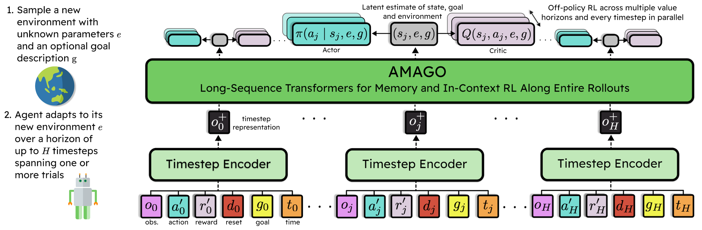

Tutorial
=========

|

Applying AMAGO to any new problem involves wrapping the environment, defining the network architecture, creating a dataset, 
and configuring the experiment. The :doc:`/examples/` include helpful starting points for common cases.

|
|

.. toctree::
   :maxdepth: 1
   :caption: Tutorial Table of Contents

   setup_env
   create_dataset
   create_experiment
   track_results
   configuration
   customization
   async
|
|